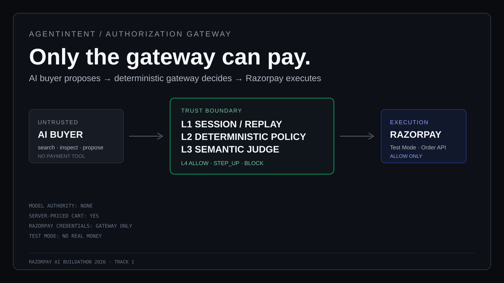
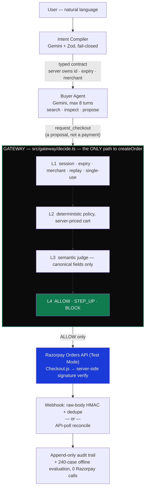

<div align="center">

# AgentIntent

### Only the gateway can pay.

A merchant-side authorization gateway between an AI buyer and Razorpay.

There is an AI buyer. There is an AI judge. There is no AI cashier.
The model can propose. The gateway decides. Only the gateway can pay.

[](https://nextjs.org)
[](https://www.typescriptlang.org)
[](https://react.dev)
[](https://www.prisma.io)
[](https://ai.google.dev)
[](https://razorpay.com)
[](https://zod.dev)
[](https://vitest.dev)
[](./LICENSE)

Razorpay AI Buildathon 2026 · Track 1: AI Growth & Agentic Commerce

`64/64 tests` · `240 eval cases` · `120 held-out · 100% accuracy` · `0 unauthorized allows` · `1 code path to money`

</div>

<div align="center">

<a href="https://www.canva.com/design/DAHUWuDXu9s/8pJTK7gbfEOiqFOqO93qYA/watch">

</a>

<p>
  <a href="https://www.canva.com/design/DAHUWuDXu9s/8pJTK7gbfEOiqFOqO93qYA/watch"><strong>▶ Watch the 5-minute demo on Canva</strong></a>
</p>

</div>

---

**What a reviewer needs to know, in order:**

1. [30-second architecture](#architecture) — one diagram, what crosses the boundary and what never does
2. [Run it yourself](#run-it-yourself) — clone → keys → three prompts → three real outcomes
3. [Why it's built this way](#design-decisions) — seven forks, what we rejected, why
4. [Proof, not claims](#security) · [Numbers](#evaluation) · [Real Razorpay ids](#real-artifacts)

---

## The problem

```
human states intent  →  AI picks a product  →  AI proposes a cart  →  payment
```

A payment API can't see the difference between these:

| User asked for | Agent proposed | Plain payment API does |
| --- | --- | --- |
| headphones under ₹8,000 | `HP-005`, ₹13,999 | charges ₹13,999 |
| "nothing with a screen" | a tablet | charges for the tablet |
| one purchase | the same intent, twice, concurrently | two orders |

The merchant is the only party who knows the purchase violated the terms — and by then the money moved. AgentIntent puts a deterministic gate in front of the payment call. The agent can search, inspect, propose. It cannot price, authorize, or pay.

---

## Architecture



**Never crosses the boundary:** Razorpay credentials (buyer/judge never hold them) · agent-authored prices (`priceCart` re-prices every cart server-side) · raw product descriptions (judge sees canonical fields only — one SKU carries a live prompt-injection fixture to prove it).

| Layer | Runs | Decides | On failure |
| --- | --- | --- | --- |
| L1 | always | session, expiry, merchant, replay | `BLOCK` |
| L2 | if L1 passed | amount, quantity, category vs. server price | `BLOCK` |
| L3 | only if L1+L2 passed | does the cart match what the user asked for? | `BLOCK` / `STEP_UP` |
| L4 | always | combines all three into one decision | `ALLOW` / `STEP_UP` / `BLOCK` |

A policy failure never reaches the model. The judge's verdict is consumed as data — it cannot raise a limit or turn a `BLOCK` into an `ALLOW`. Confidence under `0.85` goes to a human, not to a retry.

---

## Run it yourself

```bash
git clone https://github.com/auraCodesKM/agentintent.git && cd agentintent
npm install && cp .env.example .env
npm run seed
npm run dev   # → localhost:3000/demo
```

**Get keys — 2 minutes, no card, sandbox only:**

| Key | Get it | Free tier |
| --- | --- | --- |
| `GEMINI_API_KEY` | [aistudio.google.com/apikey](https://aistudio.google.com/apikey) → Create API key | 500 req/day |
| `RAZORPAY_KEY_ID` / `_SECRET` | [dashboard.razorpay.com/app/keys](https://dashboard.razorpay.com/app/keys) → toggle Test Mode → Generate Key | unlimited |
| `RAZORPAY_WEBHOOK_SECRET` | [dashboard.razorpay.com/app/webhooks](https://dashboard.razorpay.com/app/webhooks) → Add Webhook | unlimited |

**Run these three prompts on `/demo`** — each hits real Gemini + the real gateway:

| Prompt | Result | Proves |
| --- | --- | --- |
| *"StudioMax Reference headphones, budget ₹8,000 max"* | `BLOCK` · `SEMANTIC_MISMATCH` | agent substituted a product, judge caught it, `0 ORDERS CREATED` |
| *"good noise-cancelling headphones under ₹8,000, one pair"* | `ALLOW` · real `order_…` | shows up in your Razorpay Dashboard |
| *"something nice for my desk, keep it reasonable"* | `STEP_UP` · `SEMANTIC_LOW_CONFIDENCE` | escalated to merchant, no order until approved |

Test UPI: `success@razorpay` / `failure@razorpay`.

**Then, no code required:**

```bash
npm run typecheck        # clean
npm test                 # 64 tests
npm run eval:run         # 240 cases, offline, ZERO Razorpay orders
npm run demo:webhook-fail # kill the webhook, watch it recover
```

Or click **Run evaluation** on `/demo` itself — runs a real, deterministic 27-case sample of the held-out split live in the browser, ~28s, 0 Razorpay calls.

```bash
# the one invariant that matters, checkable in one line:
grep -rn "await createOrder(" src/ app/ | grep -v "razorpay/orders"
# → src/gateway/decide.ts:397   (exactly one hit)
```

---

## Design decisions

Every row is a real fork. The rejected side is included on purpose — a design that never names what it turned down hasn't been pressure-tested.

| We did | Not | Because |
| --- | --- | --- |
| Hand-written 8-turn buyer loop | LangChain / CrewAI | a generic tool-runtime makes `create_order` look like just another tool the model can pick |
| REST gateway | Razorpay MCP in front of the agent | MCP *exposes* capability — the opposite of what an authorization boundary needs |
| Low confidence → human (`STEP_UP`) | re-prompt the judge until confidence clears 0.85 | re-prompting to hit a threshold is p-hacking your own safety check |
| Atomic single-row claim | in-memory mutex / Redis lock | serverless has no "one process" to lock; the DB's own write-lock does |
| Judge sees canonical fields only | pass the full catalog record for "context" | free text is where prompt injection lives — proved with a live poisoned fixture |
| Deterministic eval ground truth | let Gemini's own verdicts define correctness | a model grading itself always converges on "the model is right" |
| SQLite local / Postgres deployed | one DB everywhere | `npm test` shouldn't need a hosted database |

---

## Security

| Property | Mechanism | Proof |
| --- | --- | --- |
| One path to money | only `decide.ts` calls `createOrder` | `grep` above |
| Single-use, atomic | one conditional `UPDATE … WHERE status='ACTIVE'` before the Razorpay call, not read-then-write | `tests/decide.test.ts` concurrent-approval cases |
| Approval isn't a weaker door | STEP_UP approval re-checks session/expiry/merchant, same as checkout | `src/gateway/session.ts` |
| Server-priced carts | buyer sends SKU + qty; gateway re-fetches price from catalog | `priceCart` |
| Judge is field-scoped | canonical fields only, never `description` | live poisoned fixture, `tests/judge-payload.test.ts` |
| Replay + idempotency | key = `intent_id + sha256(cart)`; same cart replays the same order, different cart on a consumed intent is refused | `src/gateway/replay.ts` |
| Fails closed | judge outage / bad JSON / Razorpay error → `STEP_UP` or `BLOCK`, never a silent pass | no "let it through" branch exists |
| Webhooks verified + deduped | raw-body HMAC before anything runs; event id persisted before side effects | `src/webhooks/handler.ts` |
| Test keys enforced | boot fails on anything but `rzp_test_…` | `src/razorpay/client.ts` |

---

## Evaluation

**Held-out split, 120 cases** · run `2026-09-04T21:23Z` · `gemini-3.5-flash-lite` · 165 judge calls · **0 Razorpay calls**

| Accuracy | Policy | Semantic | False blocks | Unauthorized allows | Step-up | Latency (mean/p95) |
| --- | --- | --- | --- | --- | --- | --- |
| **100%** (120/120) | 100% | 100% | **0** (₹0 GMV) | **0** | 2.5% (correct escalations) | 9.6s / 14.4s\* |

\* includes eval-pacing waits, not raw judge latency. Source: `data/eval_results.json`, renders on `/demo` (says `NOT RUN` if the file doesn't exist).

240 total = 120 legit + 120 adversarial, 8 classes (amount, quantity, category, semantic mismatch, expired, replay, prompt injection, ambiguity), split 60 dev / 60 validation / 120 held-out. Ground truth is deterministic templates — **the judge never grades its own answer.**

A separate **live** 27-case sample (3/class, held-out) runs from the demo UI itself, in ~28s, 0 Razorpay calls — always reported separately from the 120-case baseline above, never merged into one number.

*Disclosed:* an earlier run scored 98.3%, missing 4/5 ambiguity cases — the judge was confidently authorizing vague intents. Fixed with a confidence-calibration change. Old run kept at `data/eval_results_full_run1.json`, not deleted.

---

## Real artifacts

| | |
| --- | --- |
| Captured payment | `pay_TYFtu8vjA3C0iT` |
| Its order | `order_TYFPRIpLlJeFpf` · ₹7,499 |

Webhook route tested live: 400 on bad signature, 200 on valid, no-op on duplicate event id. Webhook-death → reconcile run twice — one order row survives both times.

---

## Failure handling

| Failure | Behavior | Reproduce |
| --- | --- | --- |
| Webhook never arrives | API poll recovers same order/payment, audits `WEBHOOK_TIMEOUT_RECONCILED`, no 2nd order | `npm run demo:webhook-fail` |
| Duplicate webhook | event id persisted first → 200 no-op | `scripts/webhook_route_smoke.ts` |
| LLM returns garbage | Zod rejects → 1 retry → `STEP_UP`/`BLOCK` | `tests/gemini-retry.test.ts` |
| Concurrent double-spend | atomic claim → 1 ALLOW, 1 audited `BLOCK` | `tests/decide.test.ts` |
| Payment ≠ order amount | flagged `PAYMENT_AMOUNT_MISMATCH`, not marked paid | `tests/reconcile.test.ts` |

---

## API

| Route | Purpose |
| --- | --- |
| `POST /api/sessions` | open a merchant-bound session |
| `POST /api/intents` | text → typed intent contract |
| `POST /api/agent/run` | run the bounded buyer loop |
| `POST /api/carts/propose` | server-priced cart |
| `POST /api/checkout/request` | **enters the gateway** → ALLOW/STEP_UP/BLOCK |
| `POST /api/checkout/approve` | merchant approval, re-runs L1 |
| `POST /api/checkout/verify` | server-side Checkout.js signature check |
| `POST /api/webhooks/razorpay` | HMAC + dedupe |
| `GET/POST /api/orders/:id[/reconcile]` | persisted state · recovery |
| `GET /api/audit/:intentId` | audit timeline |
| `GET /api/eval/results` · `POST /api/eval/run` | precomputed baseline · live sample |

---

## Stack

| | |
| --- | --- |
| [](https://nextjs.org) | App Router, server routes + UI, one deployable |
| [](https://www.typescriptlang.org) | every model output + API body is typed, Zod-checked |
| [](https://react.dev) | no component lib, no CSS-in-JS |
| [](https://www.prisma.io) [](https://www.sqlite.org) [](https://neon.tech) | SQLite local, Neon on deploy |
| [](https://ai.google.dev) | compiler, buyer, judge — never the authorizer |
| [](https://zod.dev) | the boundary between model output and the gateway |
| [](https://razorpay.com) | official SDK, Orders API, Checkout.js, signed webhooks |
| [](https://vitest.dev) | unit, concurrency, eval-harness tests |
| [](https://vercel.com) | `vercel.json` pins the build command |

No agent framework, no MCP runtime on the payment path, no LangChain/CrewAI/AutoGen, no vector DB. ~120 lines of hand-written buyer loop; the catalog is structured data, not RAG.

```
src/gateway/         decide.ts — the only money path · session.ts · replay.ts
src/policy/          engine.ts — pure deterministic checks
src/semantic/        judge.ts — L3, canonical fields only
src/intent/          compiler.ts        src/agent/  buyer.ts (4 tools, no payment tool)
src/razorpay/        client.ts (test-key guard) · orders.ts · payments.ts
src/webhooks/        handler.ts — dedupe + amount-mismatch flagging
src/reconciliation/  reconcile.ts — observes only, never creates
src/audit/            logger.ts — append-only
src/eval/            240 cases, zero Razorpay imports
app/demo/            the live authorization-ledger UI
```

~2,400 lines of TypeScript in `src/`, 26 SKUs / 5 categories, 64 tests, 12 API routes.

---

## What broke

| Problem | Fix |
| --- | --- |
| Eval crashed mid-run on Gemini's 20 req/day free tier | judge fails closed to `STEP_UP` per-case instead of aborting the batch |
| Replay eval cases raced across concurrency workers | pinned priming + scored pass to one job |
| `gemini-2.5-flash` 404s, `gemini-3.6-flash` rejects `thinkingConfig` | client drops the param per-model on first rejection, remembers it |
| Expiry check read stale contract JSON, not the DB row | DB row is now the single source of truth |
| Single-use check read-then-wrote *after* `createOrder` — a race window | replaced with the atomic conditional claim above |

---

## Limitations

- Semantic judgment is probabilistic — ambiguity surfaces as `STEP_UP` on purpose, costs a 2.5% step-up rate
- Test Mode only, no real money anywhere
- `POST /api/checkout/approve` is unauthenticated in this single-merchant demo — documented, not hidden
- no agent identity layer (no UAP/AP2/ACP/x402, no fraud platform) — this is the authorization boundary, not an identity protocol
- known replay-reservation edge case if a Razorpay call fails *after* the key reserves — deferred, ~0 frequency in Test Mode
- single merchant, INR, 26 SKUs

---

<div align="center">

**[MIT](./LICENSE)** © 2026 Kavin Thakur — built solo, end to end: intent compiler, buyer agent, policy engine, semantic judge, Razorpay integration, evaluation harness, this frontend.

[GitHub @auraCodesKM](https://github.com/auraCodesKM) · kavinthakur@gmail.com

Read `src/gateway/decide.ts` before this README if you only have one minute.

</div>
